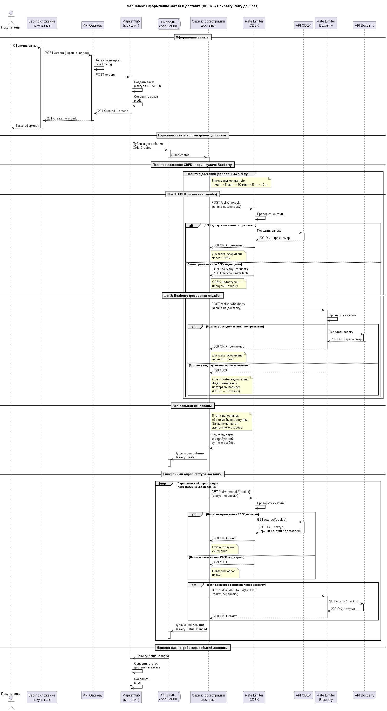
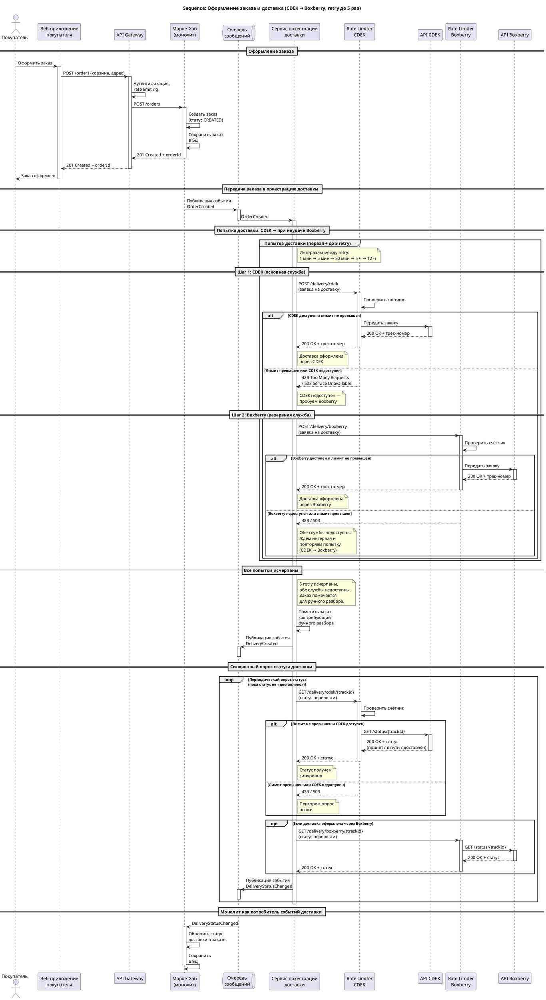

## A1. Выбор архитектурного стиля
### Контекст
Существующее решение: монолит с тремя клиентами покупатель(мобилка, веб), продавец (веб).
Существующие компонтенты:


Необходимо встроить:


### Рассмотренные варианты
#### 1 кейс
- Доработать существующий монолит
- Выделить модуль Order & Fulfillment в отдельные сервисы

#### 2 кейс
- использовать event-driven подход
- использовать синхронные вызовы

### Решения и обоснования
#### 1 кейс
**Выделить модуль Order & Fulfillment в отдельные сервисы**
1. Ни один из новых сервисов не влияет на UI покупателя. Внедряется аналитическое хранилище, которое скорее всего повлечет за собой доработки кабинета продавца (UI веб сервиса продавца и BFF для него). Если встроить аналитическое хранилище в монолит, то оно будет замедлять сервисы для покупателей. Тем более, что по требованиям по обновлению данных у нас есть 5 минут для синхронизации, что позволит, например, отправлять события с данными для аналитики и сохранять их в отдельную денормализованную БД;
2. Появляется интеграция с внешними сервисами доставки. Эти сервисы могут меняться, могут (в теории) меняться контракты этих сервисов и тп. При необходимости доработать и обновить на продакшене небольшой сервис по интеграции с внешними доставками проще, чем целый монолит;
3. За эти сервисы отвечают разные команды.

#### 2 кейс
**использовать event-driven подход**
1. Сервисы уведомлений и доставки могут "в своем темпе" разбирать события по заказам;
2. Нет требований на немедленную актуализацию статуса доставки по заказу/отправки сообщения, соответственно нет смысла "заставлять" монолит ожидать синхронную обратную связь от сервисов;
Исключение: я бы сделала синхронным взаимодействие с InventoryService т.к. нам важно получать актуальные данные о наличии перед оформлением заказа и согласованность при резервировании.

### Последствия
#### 1 кейс
Из плюсов:
- Упростится масштабирование;
- Независимый деплой.

Из минусов:
- Усложнится инфраструктура (и поддержка этой инфраструктуры);
- Усложнится мониторинг и логирование.

#### 2 кейс
Из плюсов: 
- Повышение отказоустойчивости системы: при падении потребителей (в нашем случае DeliveryService и NotificationService) сообщения не потеряются, а просто будут отправлены позже, при восстановлении работоспособности;
- Уменьшение связаности;
- С точки зрения продюсера (нашего монолита): нет необходимости обращаться к разным сервисам напрямую, нет необходимости ждать ответа от сервисов.

Из минусов:
- Усложняется архитектура системы (как минимум, появятся очереди сообщений);
- Нужно позаботиться об идемпотентности, об мониторинге и логировании.

## A2. Три клиентских канала и BFF
BFF применяется только для мобильного приложения для ускорения загрузки и экономии траффика т.к. там часто встречаются интерфейсы с ограниченной функциональностью. 

Схема:


```plantuml
@startuml
!NEW_C4_STYLE = 1
!include https://raw.githubusercontent.com/plantuml-stdlib/C4-PlantUML/master/C4_Container.puml

title МаркетХаб - диаграмма контейнеров (монолит)

Person(buyer, "Покупатель", "Просматривает каталог, оформляет заказы")
Person(seller, "Продавец", "Размещает товары, управляет ценами и остатками")

System_Ext(bank, "Платежный шлюз", "Обработка платежей")
System_Ext(delivery_cdek, "Службы доставки CDEK", "Доставка заказов покупателю")
System_Ext(delivery_boxberry, "Службы доставки Boxberry ", "Доставка заказов покупателю")
System_Ext(crm, "CRM", "Хранение профилей клиентов и истории обращений")
System_Ext(email_service, "Email-сервис", "Отправка email-писем")
System_Ext(push_service, "Push-сервис", "Отправка push-уведомлений")

Container_Boundary(marketplace, "МаркетХаб") {
    Container(web_app, "Веб-приложение_покупатель", "React, TypeScript", "Обеспечивает UI для покупателей и админов")
    Container(web_app_seller, "Веб-приложение_продавец", "React, TypeScript", "Обеспечивает UI для продавцов")
    Container(mobile_app, "Мобильное приложение_покупатель", "React Native, TypeScript", "Предоставляет интерфейс для покупателей")
    Container(bff_for_mobile_app, "BFF для мобильного приложения покупателя", "Node.js, TypeScript", "Агрегирует данные для мобильного приложения покупателя")
    Container(api_gateway, "API Gateway", "Kong / Nginx", "Маршрутизация запросов, аутентификация, rate limiting")
    
    Container(monolith, "МаркетХаб (монолит)", "Spring Boot, Java", "Каталог, заказы, платежи, пользователи, уведомления")

    Container(DeliveryService, "Сервис оркестрации доставки", "Spring Boot, Java", "Оркестрация заявок на доставку")
    Container(InventoryService, "Сервис резервирования товара", "Spring Boot, Java", "Резервирование товара")
    Container(NotificationService, "Сервис уведомлений", "Spring Boot, Java", "Рассылка Email, push, SMS уведомлений покупателям и продавцам")
    Container(AnalyticalService, "Сервис аналитики", "Spring Boot, Java", "Построение аналитических отчетов для продавцов")
    
    ContainerDb(postgres_db, "База данных", "PostgreSQL", "Товары, заказы, клиенты и прочие данные")
    ContainerDb(postgres_db_analytical, "База данных для аналитики", "PostgreSQL", "Товары, заказы, клиенты и прочие данные")
    ContainerDb(cache_catalog, "Кэш каталога", "Redis", "Кэширование популярных товаров, категорий и результатов поиска")

    ContainerQueue(message_queue, "Очередь сообщений", "RabbitMQ", "Хранит события заказов для асинхронной обработки")
}

Container_Ext(rate_limiter_cdek, "Rate Limiter CDEK", "Envoy / Nginx", "Ограничение частоты запросов к API CDEK (собственные лимиты)")
Container_Ext(rate_limiter_boxberry, "Rate Limiter Boxberry", "Envoy / Nginx", "Ограничение частоты запросов к API Boxberry (собственные лимиты)")

' Связи пользователей с UI
Rel(buyer, web_app, "Использует", "HTTPS")
Rel(buyer, mobile_app, "Использует", "HTTPS")
Rel(seller, web_app_seller, "Управляет товарами", "HTTPS")

' UI обращается к API Gateway
Rel(web_app, api_gateway, "Отправляет запросы", "HTTPS/JSON")
Rel(web_app_seller, api_gateway, "Отправляет запросы", "HTTPS/JSON")
Rel(mobile_app, api_gateway, "Отправляет запросы", "HTTPS/JSON")

' API Gateway маршрутизирует запросы
Rel(api_gateway, monolith, "Маршрутизирует запросы", "gRPC")
Rel(api_gateway, bff_for_mobile_app, "Маршрутизирует запросы", "gRPC")
Rel(monolith, InventoryService, "Маршрутизирует запросы", "gRPC")

' BFF обращается к монолиту
Rel(bff_for_mobile_app, monolith, "Отправляет запросы", "gRPC")

' Публицация событий
Rel(monolith, message_queue, "Маршрутизирует запросы", "gRPC")
Rel(monolith, message_queue, "Маршрутизирует запросы", "gRPC")
Rel(monolith, message_queue, "Маршрутизирует запросы", "gRPC")

' Публицация событий
Rel(message_queue, AnalyticalService, "Маршрутизирует запросы", "AMQP")
Rel(message_queue, DeliveryService, "Маршрутизирует запросы", "AMQP")
Rel(message_queue, NotificationService, "Маршрутизирует запросы", "AMQP")


' Сервисы работают с БД и кэшем
Rel(monolith, postgres_db, "Читает/пишет данные", "JDBC")
Rel(InventoryService, postgres_db, "Читает/пишет данные", "JDBC")
Rel(AnalyticalService, postgres_db_analytical, "Читает/пишет данные", "JDBC")
Rel(monolith, cache_catalog, "Кэширует каталог", "Redis")

' Внешние системы
Rel(monolith, bank, "Выполняет платежи", "REST API")
Rel(DeliveryService, rate_limiter_cdek, "Отправляет запросы", "HTTPS")
Rel(DeliveryService, rate_limiter_boxberry, "Отправляет запросы", "HTTPS")
Rel(rate_limiter_cdek, delivery_cdek, "Передаёт заказы на доставку", "gRPC")
Rel(rate_limiter_boxberry, delivery_boxberry, "Передаёт заказы на доставку", "gRPC")
Rel(monolith, crm, "Синхронизирует профили клиентов", "REST API")
Rel(NotificationService, email_service, "Отправляет email", "SMTP/REST")
Rel(NotificationService, push_service, "Отправляет push", "FCM/APNs")

@enduml
```

## A3. Rate Limiter: где и зачем
Первый Rate Limiter расположен в API Gateway на входящие запросы к сервисам МаркетХаба. При превышении лимита клиенту возвращается 429 Too Many Requests (Rejection mode). Лимит определяется, как 100 RPS с одного аккаунта (или IP адреса для не аунтифицированных пользователей). Нужен для того, чтобы защититься от намереных/ненамеренных атак и не перегружать систему. 
Rate Limiter в API Gateway отклоняет все запросы, которые превышают установленный лимит (вне зависимости от вида запроса).

Второй/Третий Rate Limiter указаны, как Rate Limiter внешней системы (API служб доставок), предполагается, что у них тоже Rejection mode. Но для покупателя это не видно, потому что при отклонении запроса DeliveryService пробует retry. И в случае, если и все попытки retry неуспешны, то это событие идет в ручной разбор (службой сопровождения и тп). Нужен для того, чтобы не превышать лимиты из требований и ограничений (FR-4, C-2), и не блокировать ключ.




## B4. Диагностика потенциальных антипаттернов
### Кейс А. BFF для мобильного приложения покупателя содержит логику расчёта стоимости доставки: проверяет вес товаров, применяет скидки программы лояльности, выбирает оптимальную службу доставки.
Это антипаттерн Smart UI. 
В случае маркетхаба: за стомость доставки отвечают внешние сервисы (CDEK, Boxberry), UI должен напрямую ходить к ним, что вызовет проблемы с лимитами, retry. 
### Кейс Б. OrderStatusService напрямую читает таблицу payments из базы данных PaymentService, чтобы показать покупателю статус оплаты рядом со статусом заказа.
### Кейс В. OrderOrchestratorService в одном методе: создаёт заказ, резервирует товар на складе, запрашивает тариф доставки, списывает оплату, запускает начисление баллов лояльности, отправляет email-уведомление и пишет событие в аналитику.
Что будет оцениваться: точность определения антипаттерна, понимание конкретных последствий для МаркетХаба (масштабирование, независимость команд, отказоустойчивость), качество предложенного правильного решения.

