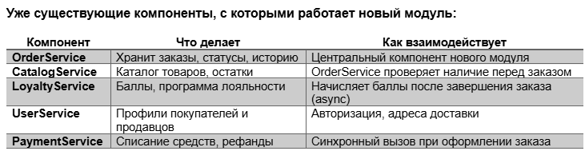
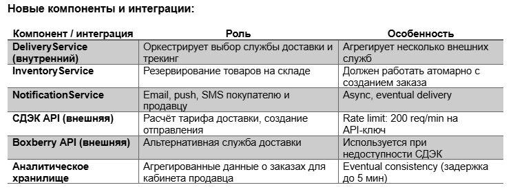
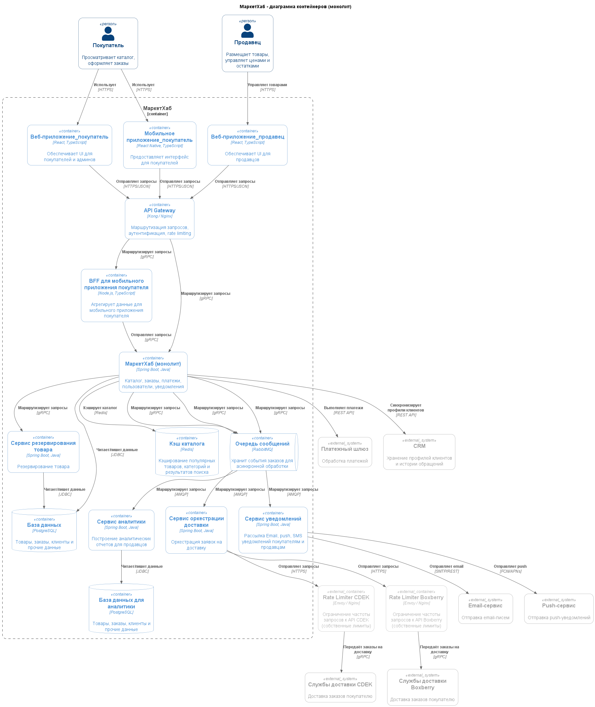

## A1. Выбор архитектурного стиля
### Контекст
Существующее решение: монолит с тремя клиентами покупатель(мобилка, веб), продавец (веб).
Существующие компонтенты:

Необходимо встроить:

### Рассмотренные варианты
#### 1 кейс
- Доработать существующий монолит
- Выделить модуль Order & Fulfillment в отдельные сервисы

#### 2 кейс
- использовать event-driven подход
- использовать синхронные вызовы

### Решения и обоснования
#### 1 кейс
**Выделить модуль Order & Fulfillment в отдельные сервисы**
1. Ни один из новых сервисов не влияет на UI покупателя. Внедряется аналитическое хранилище, которое скорее всего повлечет за собой доработки кабинета продавца (UI веб сервиса продавца и BFF для него). Если встроить аналитическое хранилище в монолит, то оно будет замедлять сервисы для покупателей. Тем более, что по требованиям по обновлению данных у нас есть 5 минут для синхронизации, что позволит, например, отправлять события с данными для аналитики и сохранять их в отдельную денормализованную БД;
2. Появляется интеграция с внешними сервисами доставки. Эти сервисы могут меняться, могут (в теории) меняться контракты этих сервисов и тп. При необходимости доработать и обновить на продакшене небольшой сервис по интеграции с внешними доставками проще, чем целый монолит;
3. За эти сервисы отвечают разные команды.

#### 2 кейс
**использовать event-driven подход**
1. Сервисы уведомлений и доставки могут "в своем темпе" разбирать события по заказам;
2. Нет требований на немедленную актуализацию статуса доставки по заказу/отправки сообщения, соответственно нет смысла "заставлять" монолит ожидать синхронную обратную связь от сервисов;
Исключение: я бы сделала синхронным взаимодействие с InventoryService т.к. нам важно получать актуальные данные о наличии перед оформлением заказа и согласованность при резервировании.

### Последствия
#### 1 кейс
Из плюсов:
- Упростится масштабирование;
- Независимый деплой.

Из минусов:
- Усложнится инфраструктура (и поддержка этой инфраструктуры);
- Усложнится мониторинг и логирование.

#### 2 кейс
Из плюсов: 
- Повышение отказоустойчивости системы: при падении потребителей (в нашем случае DeliveryService и NotificationService) сообщения не потеряются, а просто будут отправлены позже, при восстановлении работоспособности;
- Уменьшение связаности;
- С точки зрения продюсера (нашего монолита): нет необходимости обращаться к разным сервисам напрямую, нет необходимости ждать ответа от сервисов.

Из минусов:
- Усложняется архитектура системы (как минимум, появятся очереди сообщений);
- Нужно позаботиться об идемпотентности, об мониторинге и логировании.

## A2. Три клиентских канала и BFF
BFF применяется только для мобильного приложения для ускорения загрузки и экономии траффика т.к. там часто встречаются интерфейсы с ограниченной функциональностью. 

Схема (код расположен Homework_3\schema.puml):

