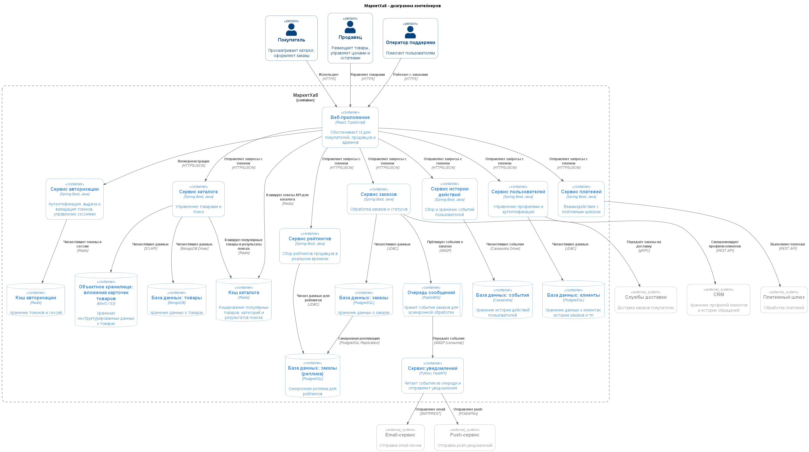
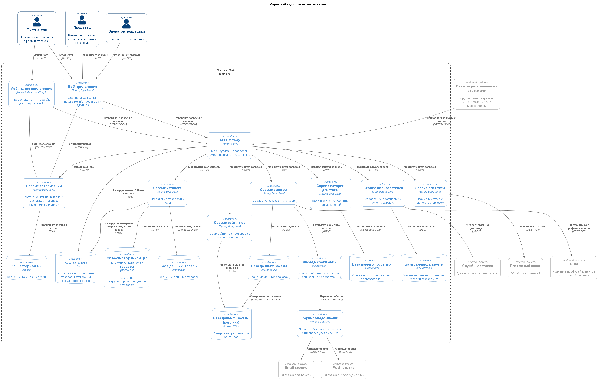

# Solution
## Схемы "До" и "После"
В целом, схема уже почти была готова на 5 уроке
### Схема "ДО":

### Схема "После"

## Таблица маршрутов

| Сценарий                                 | Метод                                                                                       | Путь (указала эндпоинт, но фактически все будут обращаться к Gateway, не зная конкретных сервисов и хостов) | Целевой сервис                                                                    | Авторизация | Лимит запросов |
| ---------------------------------------- | ------------------------------------------------------------------------------------------- | ----------------------------------------------------------------------------------------------------------- | --------------------------------------------------------------------------------- | ----------- | -------------- |
| Покупатель смотрит каталог товаров       | GET/POST (предполагаю, что для некоторых сложных запросов чтения может использоваться POST) | v1/products                                                                                                 | Сервис каталога                                                                   | Нет         | 50 RPS         |
| Покупатель оформляет заказ               | POST                                                                                        | v1/orders                                                                                                   | Сервис заказов                                                                    | Да          | 50 RPS         |
| Продавец обновляет данные о товаре       | PUT/PATCH                                                                                   | v1/product/{id}                                                                                             | Сервис каталога                                                                   | Да          | 50 RPS         |
| Партнёр-логист запрашивает статус заказа | GET                                                                                         | /orders/{id}                                                                                                | Сервис заказов                                                                    | Да          | 50 RPS         |
| Публичный health check системы           | GET                                                                                         | /health                                                                                                     | Не очень понимаю, чем это является, но скорее всего должен быть у каждого сервиса | Нет         | 2 RPS          |
Значение 50 RPS взято с ограничения озона для API для селлеров (https://dev.ozon.ru/news/584-Vnedriaem-novye-limity-v-Seller-API-s-19-maia/). Скорее всего лимиты на просмотр каталогов и создания заказа могут быть больше, но слабо себе представляю, чтобы один клиент (по ID/IP) в реальности генерировал больше 50 RPS в адекватной ситуации.

## Gateway и SPOF

1. Что произойдёт с МаркетХабом, если единственный инстанс Gateway упадёт?
    Весь МаркетХаб станет недоступен
2. Что нужно добавить в архитектуру, чтобы это не стало катастрофой?
    Добавить ещё как минимум один инстанс Gateway и балансировщик перед ними (и можно ещё и балансировщик запасной сделать)
3. Какие требования к доступности Gateway нужно зафиксировать в NFR, если сервис заказов требует 99.9% uptime?
    Тоже 99.9% uptime, требование к доступности любого SPOF всегда будут равны самым высоким требованиям к доступности любого из сервисов
